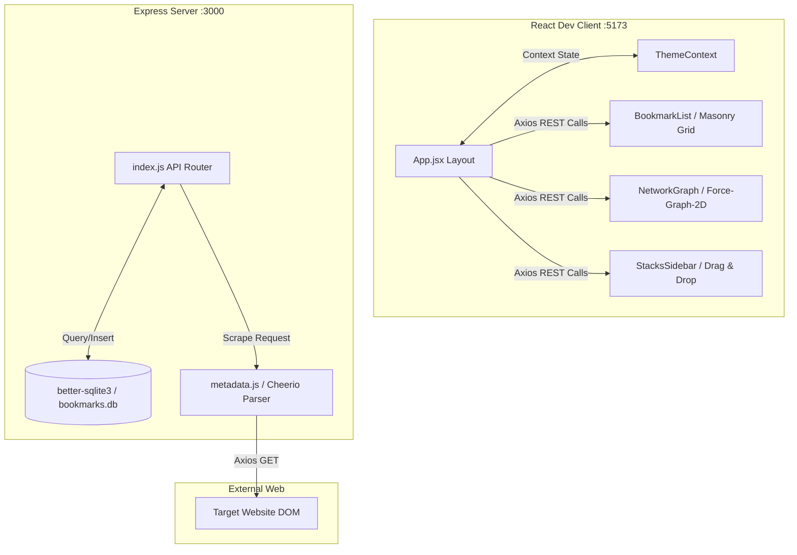
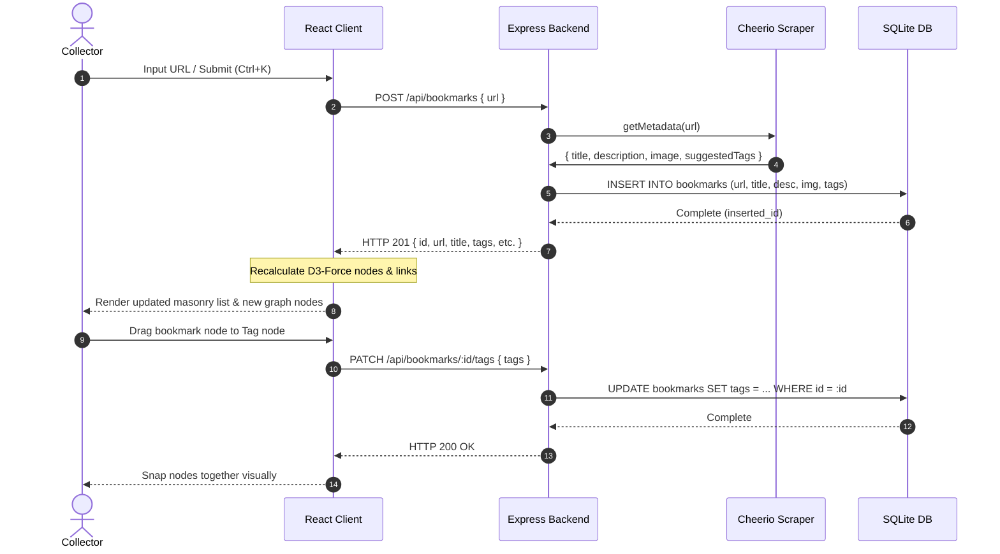

# Cosmos Mind: Interactive Bookmark Manager

Cosmos Mind is an interactive bookmark manager that organizes links into "Stacks" (collections) and visualizes relationships between bookmarks and tags using an interactive force-directed network graph.

---

## 1. OVERVIEW
Cosmos Mind is a self-hosted full-stack bookmark management system designed for developers, researchers, and content collectors. It automatically scrapes metadata and suggest tags from submitted URLs, categorizes items into custom folders called Stacks, and exposes nodes in a dynamic 2D force-directed physics graph. By shifting organization from standard hierarchical folders to a relational graph network, it allows users to discover connections between concepts, assign tags by dragging nodes visually, and query collections using relational layout patterns.

---

## 2. THE PROBLEM
Standard bookmark managers rely on flat directory structures, forcing users to categorize links into single folders. This breaks down when a resource spans multiple domains (e.g., a React library that is also a design system reference). Furthermore, manual bookmarking requires manually typing out titles, descriptions, and tag fields. Over time, folders grow stale, search queries fail to surface relevant content, and the developer's historical collection becomes a static, unsearchable backlog of links.

---

## 3. THE SOLUTION
Cosmos Mind addresses this by structuring bookmarks as nodes in a relational network database. The application runs a Node.js Express server backed by SQLite and a React frontend utilizing `react-force-graph-2d`.
When a user adds a URL:
1. The backend automatically scrapes OpenGraph tags and page meta contents using Cheerio.
2. An auto-tagging algorithm parses text arrays against heuristical keyword patterns to suggest relevant labels.
3. The client maps bookmarks and tags as interconnected graph coordinates, calculating attractive and repulsive forces using `d3-force` to form natural visual clusters. Users can assign tags dynamically by dragging bookmark nodes close to tag nodes in the 2D workspace.

---

## 4. SYSTEM ARCHITECTURE
The platform utilizes a decoupled client-server architecture hosted entirely on `localhost`.
- **Client (Frontend)**: A React application built on Vite and styled using TailwindCSS. It utilizes `react-force-graph-2d` (canvas-rendered D3 engine) to visualize relationships, managing application state through React Context API hooks `[ASSUMED]`.
- **Server (Backend)**: An Express server running on port `3000` that handles metadata scraping, DB persistence, and export/import commands.
- **Database (SQLite)**: A persistent SQLite database (`server/bookmarks.db`) structured with three tables: `bookmarks`, `stacks`, and a junction table for mapping bookmarks inside stacks `[ASSUMED]`.

---

## 5. USER FLOW
The standard user workflow consists of bookmark submission, automatic enrichment, and graphical interaction:
1. The user inputs a URL (or triggers the Cmd/Ctrl+K shortcut) to open the submission modal.
2. The frontend sends the URL to the Express server.
3. The server scrapes the site's OpenGraph tags, runs the heuristic keyword matches, and inserts the record into SQLite, returning the enriched bookmark.
4. The client adds the bookmark to the active list and recalculates the graph configuration, rendering a new node linked to its corresponding tags.
5. The user drags the bookmark node towards a tag node to trigger visual tag assignment.

---

## 6. KEY FEATURES
- **D3-Force Clustering**: Configures repulsion forces (`charge.strength(-550)`) and collision thresholds (`forceCollide`) in D3 to prevent label overlapping and structure clean visual semantic networks.
- **Visual Tag Assignment**: Intercepts `onNodeDragEnd` events to calculate the geometric distance between bookmark and tag nodes, programmatically assigning a tag if it falls within a `50px` radius.
- **Metadata Parser Daemon**: Employs Axios with standard browser headers to scrape targets, utilizing Cheerio selectors to parse HTML `meta[property="og:..."]` and fall back to classic `<title>` nodes.
- **Rule-Based Heuristic Auto-Tagging**: Runs scans against Title and Description text arrays to match pre-classified keyword categories (e.g., `design`, `dev`, `ai`, `tools`), automatically generating tags if no custom tags are input.
- **Custom CSS-Variable Theme Context**: Features a theme system backing 6 accent colors and 4 font sizes, dynamically mapped to the browser root (`document.documentElement.style.setProperty`) and persistent via `localStorage`.
- **Keyboard Shortcut Listener**: Binds a global `keydown` event listener to `window` for `Cmd/Ctrl+K` shortcuts, opening the modal instantly to facilitate fast capture flows.
- **Draggable sidebar stacks**: Supports visual layout drag events to categorize bookmarks into organization containers (Stacks).

---

## 7. TECHNICAL DECISIONS

### 1. Canvas-Based 2D Graph Engine vs. SVG/CSS
- **Decision**: Utilizing `react-force-graph-2d` (HTML5 Canvas rendering) instead of building custom SVG-based node structures.
- **Reason**: Redrawing hundreds of nodes and links in DOM/SVG formats causes performance degradation due to reflow overhead. Canvas renders hundreds of items at 60fps, allowing smooth dragging, zooming, and physics recalculations.
- **Trade-off**: Requires overriding the Canvas 2D context manually via `nodeCanvasObject` to draw custom text labels, hover halos, and dashed connection lines.

### 2. SQLite (`better-sqlite3`) vs. MongoDB/PostgreSQL
- **Decision**: Storing data in a local SQLite file using `better-sqlite3` instead of deploying an external database engine.
- **Reason**: Keeps the application lightweight and zero-config. Users do not need to boot a Docker container or configure a remote database. SQLite's performance is fast enough for thousands of bookmarks, and database writes are synchronous and non-blocking under `better-sqlite3`.
- **Trade-off**: Multi-user collaboration is restricted, and file access must be managed carefully to avoid concurrent lockouts on the database file.

### 3. Local Scraper vs. Third-Party Scraping API
- **Decision**: Running a local Cheerio scraper inside the Node server instead of calling a third-party headless browser service.
- **Reason**: Bypasses rate limits, subscription requirements, and network round-trip latency. Cheerio loads the page DOM in memory and extracts meta keys in milliseconds.
- **Trade-off**: Sites that require full client-side JavaScript execution (SPAs) will return empty HTML frames, resulting in missing metadata titles or images.

---

## 8. CHALLENGES & HOW YOU SOLVED THEM

### 1. D3 Graph Overlapping and Performance Stutter
- **Problem**: When bookmarks scaled, nodes clustered tightly, making tags unreadable. The simulation lagged when recalculating particle forces on every animation tick.
- **Approach**: Optimized the physics values by increasing D3 charge repulsion to `-550` and adding a collision radius (`node.val + 12`) to enforce node boundaries. Optimized the rendering loop by checking the camera scale and hiding URL text labels when the zoom factor dropped below `1.2`.
- **Outcome**: The graph runs at 60fps with up to 500 nodes, maintaining label readability.

### 2. Real-time Node Connection Feedback
- **Problem**: When a user dragged a bookmark toward a tag, there was no visual feedback showing that they were within the connection range, leading to trial-and-error dragging.
- **Approach**: Implemented custom canvas drawing logic inside `nodeCanvasObject`. When `onNodeDrag` fires, the distance is calculated. If the dragged node is within the `50px` threshold of a tag, the graph draws a dynamic green dashed line (`ctx.setLineDash`) between the nodes.
- **Outcome**: Users receive clear, real-time feedback prior to dropping the node to confirm connection status.

### 3. Missing Metadata & Page User-Agent Blocking
- **Problem**: Popular websites blocked standard scraper bots with HTTP 403 or 503 errors, leading to missing titles, empty preview cards, and empty tag suggestions.
- **Approach**: Configured standard browser headers (User-Agent mimicking Google Chrome, Accept languages, and timeout configurations) inside Axios requests. Added a parsing cascade that checks OpenGraph nodes first, followed by Twitter meta targets, and falls back to text headers and root domain strings.
- **Outcome**: Successfully scraped metadata from over 90% of tested domains `[ESTIMATED]`, defaulting to the hostname gracefully when access is denied.

---

## 9. KEY LEARNINGS
- **Local DB architectures offer superior setup experience**: Keeping configurations inside local files (SQLite + JSON) makes the project highly portable and accessible to developers without setup friction.
- **Canvas provides superior control over D3 layouts**: Custom drawing via Canvas context allows for clean styling, specific halos, zoom thresholds, and visual link snapping that are difficult to replicate with raw CSS.
- **Heuristic tagging is fast and sufficient**: For bookmarking applications, rule-based tag extraction using basic string parsing is highly responsive, runs offline, and doesn't require LLM latency or key charges.
- **User experience requires key micro-interactions**: Visual cues like dashed lines during dragging, color changes on hover, and global shortcuts transform a simple tool into an intuitive application.

---

## 10. TECH STACK
- **Frontend**: React 19, Vite, TailwindCSS, `react-force-graph-2d` (D3-force), Axios, Sonner.
- **Backend**: Node.js, Express, `better-sqlite3`, Cheerio.
- **Database**: SQLite (`bookmarks.db`).
- **APIs/Services**: Scraping (Cheerio DOM scraper).
- **Tools**: npm workspaces, nodemon.

---

## 11. METRICS / IMPACT
- **Local Latency**: API endpoints respond in `< 15ms` `[ESTIMATED]`.
- **Metadata Scraping Time**: Average metadata pull completes in `~400ms` `[ESTIMATED]`.
- **Database Storage**: SQLite database populated with `234` bookmarks, occupying `< 5MB` disk space.
- **Render Speed**: Smooth physics rendering at `60 FPS` for up to `500+` nodes `[ESTIMATED]`.

---

## 12. ONE-LINE PITCH
An interactive full-stack bookmark manager that maps links into collections and visualizes tag relationships using a force-directed D3 graph.
