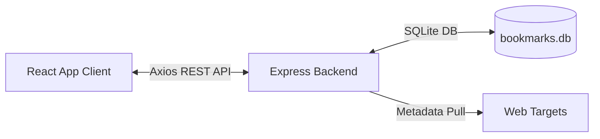
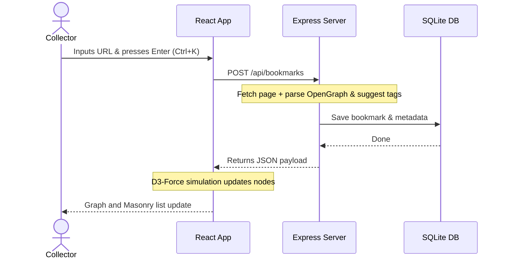

# 🌌 Cosmos Mind

Cosmos Mind is an interactive, self-hosted bookmark manager that organizes your links into structured **Stacks** and visualizes the relationships between your bookmarks and tags in a dynamic **2D force-directed physics graph**. 

Instead of traditional, nested folder hierarchies, Cosmos Mind maps your digital library as a relational semantic network—allowing you to discover hidden connections, visually drag nodes to assign tags, and customize the interface to match your workspace setup.

---

## ✨ Key Features

*   **🔮 Dynamic 2D Graph Interface**: Interact with your links as visual clusters. Pan, zoom, and filter the network layout populated dynamically by `d3-force`.
*   **🏷️ Visual Drag-and-Drop Tagging**: Simply drag a bookmark node near any tag node in the graph workspace to link them instantly.
*   **🌐 Auto-Metadata Extraction**: Input a URL and the backend automatically scrapes the OpenGraph meta titles, descriptions, and preview images using Cheerio.
*   **🧠 Heuristic Auto-Tagging**: Scrapes webpage text and matches keywords to automatically suggest relevant category tags (e.g., `design`, `dev`, `ai`, `tools`, `inspiration`).
*   **📚 Stacks Sidebar**: Group related resources into custom drag-and-drop collections (Stacks) for structured reading lists and project resources.
*   **⌨️ Global Command Palette**: Open the addition modal instantly from anywhere in the application with the `Cmd/Ctrl + K` hotkey.
*   **🎨 Custom Accent System**: A responsive glassmorphic dark mode featuring six custom accent colors and four typography options persistent via local storage.

---

## 🛠️ Tech Stack

*   **Frontend**: React 19, Vite, TailwindCSS, `react-force-graph-2d` (HTML5 Canvas engine), Axios, Sonner.
*   **Backend**: Node.js, Express.
*   **Database**: SQLite (`better-sqlite3`) for fast, local-first synchronous storage.
*   **Scraper**: Cheerio HTML parser.

---

## 🚀 Getting Started

### Prerequisites
Make sure you have [Node.js](https://nodejs.org/) (version 18+) installed on your machine.

### Installation
Clone the repository and install dependencies for both client and server applications using the root script:

```bash
# Install all dependencies in one command
npm run install:all
```

### Running Locally
To launch both the Node.js Express server (`http://localhost:3000`) and the Vite development server (`http://localhost:5173`) concurrently, run:

```bash
npm start
```

---

## 🔍 System Architecture & Workflows

Cosmos Mind runs a lightweight, zero-cloud architecture fully localized to your machine. 



### Automatic Link Enrichment


---

## ⌨️ Shortcuts & Graph Controls

*   **`Cmd/Ctrl + K`**: Open/Close the "Add Bookmark" modal.
*   **`Escape`**: Close active modals.
*   **`Left Click (Tag Node)`**: Focus on tag connections (dimming other unrelated nodes).
*   **`Double Click (Stack Name)`**: Filter the D3-force network graph workspace to display only items from that specific collection.
*   **`Drag Node`**: Drag a bookmark node to physics-connect it to a nearby tag node.
